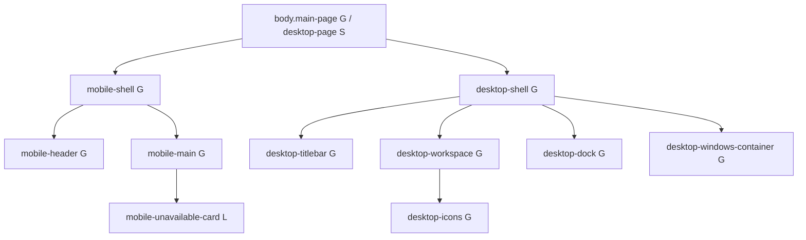

# AUTH DOM - Global vs Local Classes

Legenda:
- `G` = classe global (importada de `templates/styles/*`)
- `L` = classe local do modulo auth (`auth/src/public/styles/scss/_auth-module.scss`)
- `S` = classe sem regra CSS propria no estado atual (semantica/JS)

## 1) Shell Base (Mobile + Desktop)



```text
body.main-page[G].desktop-page[S]
|- div.mobile-shell[G]
|  |- header.mobile-header[G]
|  |  \- div.mobile-header-content[G]
|  |     |- div
|  |     |  \- h1
|  |     |- div.mobile-user[G]
|  |     |  |- strong
|  |     |  \- span
|  |     \- a.mobile-back[G]
|  \- main.mobile-main[G]
|     |- h2
|     \- div.mobile-unavailable-card[L]
|        \- p > a.mobile-back[G]
\- div.desktop-shell[G]
   |- header.desktop-titlebar[G]
   |  |- div.titlebar-left[G]
   |  |  |- span.traffic-light.red[G]
   |  |  |- span.traffic-light.yellow[G]
   |  |  |- span.traffic-light.green[G]
   |  |  \- strong.desktop-brand[G]
   |  |- div.titlebar-center[G]
   |  |  \- span.desktop-clock[G]
   |  \- div.titlebar-right[G]
   |     |- span.desktop-user[G]
   |     |  |- strong
   |     |  \- span.desktop-user-role[G]
   |     |- a.titlebar-back[G]
   |     \- form.titlebar-logout[G] > button
   |- main.desktop-workspace[G]
   |  \- section.desktop-icons[G]
   |     \- button.desktop-icon[G] x3
   |        |- span.desktop-icon-glyph[G].desktop-icon-folder[L]
   |        |  |- span.desktop-icon-folder-main[L]
   |        |  \- span.desktop-icon-folder-badge[L]
   |        \- span.desktop-icon-name[G]
   \- nav.desktop-dock[G]
      \- div.dock-inner[G]
         |- button.dock-item[G] > span.dock-item-glyph[G] x3
         \- a.dock-back[G]
```

## 2) Window Framework (Estrutura comum)

```text
div.desktop-windows-container[G]
|- div.desktop-overlay[G]
\- div.desktop-window[G] (varias instancias)
   |- div.desktop-window-titlebar[G]
   |  |- strong.desktop-window-title[G]
   |  \- button.desktop-window-close[G]
   |- nav.window-menu[G] (somente em users-list)
   |  |- div.window-menu-item[G]
   |  |  |- button.window-menu-trigger[G]
   |  |  \- div.window-menu-dropdown[G]
   |  |     \- a.window-menu-option[G]
   \- div.desktop-window-content[G]
```

## 3) Window Content Local (Por janela)

### 3.1 Session

```text
div.desktop-window.window-session[G+L]
\- div.desktop-window-content[G]
   \- div.window-session-wrapper[L]
      \- div.users-launcher-grid[L]
         \- button.users-launcher-icon[L]
            |- span.users-launcher-glyph[L]
            |- span.users-launcher-name[L]
            \- span.users-launcher-caption[L]
```

### 3.2 Session Info

```text
div.desktop-window.window-session-info[G+L]
\- div.desktop-window-content[G]
   \- div.session-info-body[L]
      \- table.session-table[L]
```

### 3.3 Session Password

```text
div.desktop-window.window-session-password[G+L]
\- div.desktop-window-content[G]
   \- div.password-form-wrap[L]
      \- form.password-form[L]
         |- label.password-label[L]
         |- p.password-hint[L]
         |- div.password-actions[L] > button.password-submit[L]
         \- p.password-feedback[L]
```

### 3.4 Users (launcher)

```text
div.desktop-window.window-users[G+L]
\- div.desktop-window-content[G]
   \- section.window-users-wrapper[L]
      \- div.users-launcher-grid[L]
         |- button.users-launcher-icon[L]
         \- a.users-launcher-icon.is-disabled[L] x2
```

### 3.5 OneDrive

```text
div.desktop-window.window-onedrive[G+L]
\- div.desktop-window-content[G]
   |- section.users-launcher-grid[L]
   |  \- button.users-launcher-icon[L] x4
   |- div.onedrive-status-panel[L]
   |  |- span.onedrive-status-text[L]
   |  \- button.onedrive-status-dismiss[L]
   \- div.onedrive-confirm-modal[L].window-confirm-modal[G]
      |- p.onedrive-confirm-message[L].window-confirm-message[G]
      \- div.onedrive-confirm-actions[L].window-confirm-actions[G]
         |- button.password-submit[L].onedrive-confirm-btn-danger[L].window-confirm-btn-danger[G]
         \- button.password-submit[L]
```

### 3.6 OneDrive Setup

```text
div.desktop-window.window-onedrive-setup[G+L]
\- div.desktop-window-content[G]
   \- form.onedrive-setup-form[L]
      |- label.password-label[L]
      |- p.password-hint[L]
      |- div.onedrive-setup-feedback[L]
      \- div.password-actions[L] > button.password-submit[L]
```

### 3.7 Users List (table filters)

```text
div.desktop-window.window-users-list[G+L].window-table-content[L]
|- nav.window-menu[G]
\- div.desktop-window-content[G]
   \- div.users-list-wrap[L]
      \- form
         |- div.users-table-filter-summary[G]
         |  |- div.pagination-info[G]
         |  \- button.btn[G].btn-muted[G].users-table-filter-summary-clear[S]
         |- p.users-table-edit-hint[L]
         |- div.table-wrap[G]
         |  \- table.users-list-table[L]
         |     |- th > div.table-filter-head[G] + button.table-filter-toggle[G]
         |     \- tr.data-row[S] > td > span.users-list-badge[L].is-authorized[L] | .is-pending[L]
         \- div.table-pagination[G]
            |- button.btn[G].btn-muted[G]
            \- span.table-pagination-info[G]
```

### 3.8 User Edit

```text
div.desktop-window.window-user-edit[G+L]
\- div.desktop-window-content[G]
   \- div.user-edit-window-wrap[L]
      \- form.user-edit-window-form[L]
         |- div.user-edit-window-grid[L]
         |  |- div.user-edit-window-field[L] > label.user-edit-window-label[L]
         |  \- div.user-edit-window-field[L].user-edit-window-field-full[L].user-edit-window-checkline[L]
         |- div.user-edit-window-actions[L]
         |  |- button.btn[S].btn-primary[L]
         |  \- button.btn[G].btn-muted[G]
         |- p.user-edit-window-feedback[L]
         \- p.user-edit-window-note[L]
```

## Source de referencia

- `auth/src/views/index.ejs`
- `auth/src/views/partials/desktop/*.ejs`
- `auth/src/public/styles/scss/app.scss`
- `auth/src/public/styles/scss/_auth-module.scss`
- `templates/styles/_globals.scss`
- `templates/styles/shell-desktop/*`
- `templates/styles/shell-mobile/*`
- `templates/styles/components/_table-filters.scss`
