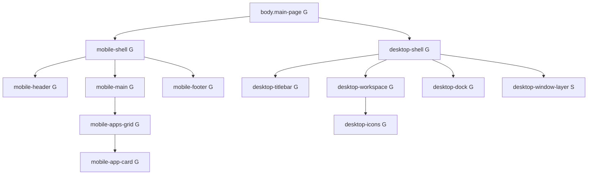

# MAPAS DOM - Global vs Local Classes

Legenda:
- `G` = classe global (importada de `templates/styles/*`)
- `L` = classe local do modulo mapas (`mapas/src/public/styles/scss/_mapas-module.scss`)
- `S` = classe sem regra CSS propria no estado atual (semantica/JS ou alvo indireto)

Nota importante:
- As classes `desktop-window-layer`, `desktop-window-backdrop`, `desktop-floating-window`, `desktop-floating-window-titlebar`, `desktop-floating-window-close`, `desktop-floating-window-frame` e `desktop-floating-window-resize` aparecem no DOM das janelas do mapas, mas neste momento nao tem bloco SCSS dedicado (classificadas como `S`).

## 1) Shell Base (Mobile + Desktop)



```text
body.main-page[G]
|- div.mobile-shell[G]
|  |- header.mobile-header[G]
|  |  \- div.mobile-header-content[G]
|  |     |- div > h1
|  |     |- div.mobile-user[G] > strong + span
|  |     \- a.mobile-back[G]
|  |- main.mobile-main[G]
|  |  |- h2
|  |  \- div.mobile-apps-grid[G]
|  |     \- div.mobile-app-card[G] (repetido por modulo)
|  |        |- h3
|  |        |- p
|  |        \- a
|  \- footer.mobile-footer[G]
\- div.desktop-shell[G]
   |- header.desktop-titlebar[G]
   |  |- div.titlebar-left[G]
   |  |  |- span.traffic-light.red[G]
   |  |  |- span.traffic-light.yellow[G]
   |  |  |- span.traffic-light.green[G]
   |  |  \- strong.desktop-brand[G]
   |  |- div.titlebar-center[G] > span.desktop-clock[G]
   |  \- div.titlebar-right[G]
   |     |- span.desktop-user[G] > strong + span.desktop-user-role[G]
   |     |- a.titlebar-back[G]
   |     \- form.titlebar-logout[G] > button
   |- main.desktop-workspace[G]
   |  \- section.desktop-icons[G]
   |     \- a.desktop-icon[G] (+ .is-disabled[G] quando aplicavel)
   |        |- span.desktop-icon-glyph[G]
   |        \- span.desktop-icon-name[G]
   |- nav.desktop-dock[G]
   |  \- div.dock-inner[G]
   |     |- a.dock-item[G] (+ .is-disabled[G] quando aplicavel) > span.dock-item-glyph[G]
   |     \- a.dock-back[G]
   |- div.desktop-window-layer[S]#diarioDesktopLayer
   \- div.desktop-window-layer[S]#auditoriaDesktopLayer
```

## 2) Window Framework (janelas flutuantes do Mapas)

```text
div.desktop-window-layer[S]
|- div.desktop-window-backdrop[S]
\- section.desktop-floating-window[S]
   |- header.desktop-floating-window-titlebar[S]
   |  |- strong
   |  \- button.desktop-floating-window-close[S]
   |- nav.window-menu[G]
   |  |- div.window-menu-item[G]
   |  |  |- button.window-menu-trigger[G]
   |  |  \- div.window-menu-dropdown[G]
   |  |     |- a.window-menu-option[G]
   |  |     |- label.window-menu-checkbox[G] > input
   |  |     \- div.window-menu-divider[G]
   |- div.desktop-floating-window-frame[S]
   \- button.desktop-floating-window-resize[S]
```

## 3) Inline Window Content (Diario / Auditoria)

### 3.1 Diario de Caixa (conteudo carregado dentro de `#diarioDesktopFrame`)

```text
main.mobile-main[G]
|- section.mobile-unavailable-card[L]
|  |- h1
|  |- p
|  \- p > a
\- section.desktop-only-feature[L].window-canvas[L]
   \- article.desktop-window[G].desktop-window--overlay[S]
      \- div.window-content[S]
         \- form[data-grid-form]
            |- div.users-table-filter-summary[G]
            |  |- div.pagination-info[G]
            |  \- div.year-filter-group[L]
            |     |- label.year-filter-label[L]
            |     |- input.year-filter-input[L]
            |     \- button.btn[G].btn-muted[G].users-table-filter-summary-clear[S]
            |- div.table-wrap[G]
            |  \- table.diario-table[L]
            |     |- th > div.table-filter-head[G] + button.table-filter-toggle[G]
            |     \- tr.data-row[S]
            |        |- td.diario-col-data[L]
            |        \- td.diario-col-valor[L]
            \- div.table-pagination[G]
               |- button.btn[G].btn-muted[G]
               \- span.table-pagination-info[G]
```

### 3.2 Auditoria Logs (conteudo carregado dentro de `#auditoriaDesktopFrame`)

```text
main.mobile-main[G]
|- section.mobile-unavailable-card[L]
\- section.desktop-only-feature[L].window-canvas[L]
   \- article.desktop-window[G].desktop-window--overlay[S]
      \- div.window-content[S]
         \- form[data-grid-form]
            |- div.users-table-filter-summary[G]
            |  |- div.pagination-info[G]
            |  \- div.year-filter-group[L]
            |     |- label.year-filter-label[L]
            |     |- input.year-filter-input[L]
            |     \- button.btn[G].btn-muted[G].users-table-filter-summary-clear[S]
            |- div.table-wrap[G]
            |  \- table.auditoria-table[L]
            |     |- th > div.table-filter-head[G] + button.table-filter-toggle[G]
            |     \- td.auditoria-payload-cell[L]
            |        \- details.payload-collapse[L]
            |           |- summary
            |           |  |- span.payload-toggle[L]
            |           |  \- span.payload-preview[L]
            |           \- pre
            \- div.table-pagination[G]
               |- button.btn[G].btn-muted[G]
               \- span.table-pagination-info[G]
```

## 4) Classes de estado/estrutura sem estilo dedicado (S)

- `desktop-window-layer`
- `desktop-window-backdrop`
- `desktop-floating-window`
- `desktop-floating-window-titlebar`
- `desktop-floating-window-close`
- `desktop-floating-window-frame`
- `desktop-floating-window-resize`
- `desktop-window--overlay`
- `window-content`
- `data-row`
- `users-table-filter-summary-clear`

## Source de referencia

- `mapas/src/views/index.ejs`
- `mapas/src/views/windows/diario-caixa.ejs`
- `mapas/src/views/windows/auditoria-logs.ejs`
- `mapas/src/views/diario-caixa-list.ejs`
- `mapas/src/views/auditoria-logs-list.ejs`
- `mapas/src/public/styles/scss/app.scss`
- `mapas/src/public/styles/scss/_mapas-module.scss`
- `templates/styles/_globals.scss`
- `templates/styles/shell-desktop/*`
- `templates/styles/shell-mobile/*`
- `templates/styles/components/_table-filters.scss`
